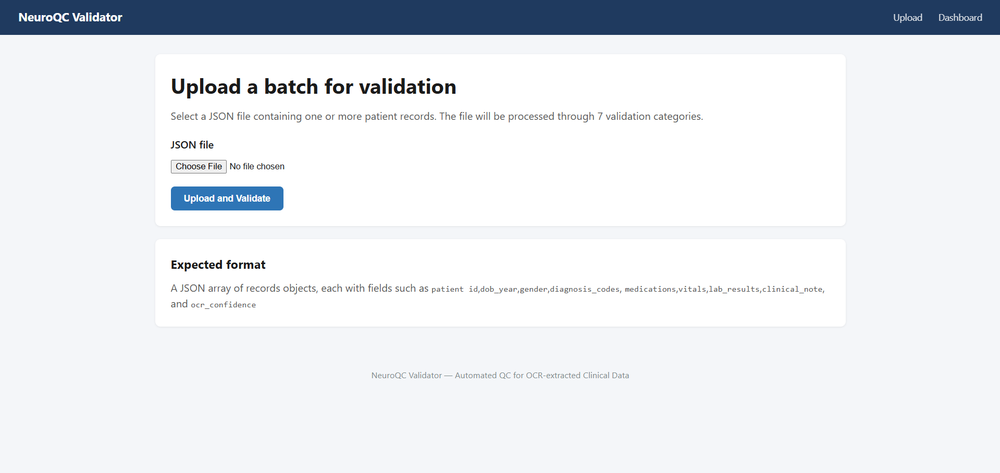
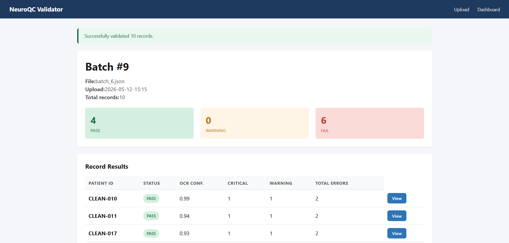

README.md (full template)
# NeuroQC Validator


> Automated QC and PHI leak detection for OCR-extracted clinical data.

NeuroDiscovery AI processes electronic health records from 540+ neurology clinics across
the US. Their pipeline uses OCR to extract text from scanned documents, then LLMs to
refine that text into structured JSON records. The final step today is **manual QC**: a
human associate reviews flagged records for errors. With 5.2 million patient records and
100 million clinical notes, that step does not scale.

**NeuroQC Validator** is a working prototype that automates ~70-80% of that manual review
by running seven categories of programmatic checks on JSON records before they hit the
gold layer — including a PHI leak detector that catches HIPAA violations missed by
upstream de-identification.

## 🔗 Live Demo

**Try it now:** https://YOUR-USERNAME.pythonanywhere.com

Sample data is included in the `sample_data/` folder. Upload `dirty_batch.json` to see the
validator catch out-of-range vitals, invalid ICD codes, misspelled drug names, and PHI
leaks all at once.

## 🛠 What It Validates

| # | Validator | What It Catches |
|---|-----------|-----------------|
| 1 | **Schema** | Missing required fields, wrong data types, invalid enums |
| 2 | **Range** | Vitals and lab values outside medically possible ranges (e.g., systolic
BP of 928 from an OCR misread of 128) |
| 3 | **ICD-10** | Invalid diagnosis codes, with edit-distance suggestions for OCR errors
(G4O.909 → G40.909) |
| 4 | **Medication** | Misspelled drug names via rapidfuzz fuzzy matching (Levtiracetam →
Levetiracetam, 93% match) |
| 5 | **Completeness** | Null/missing fields, with per-field error categorization |
| 6 | **PHI Leak** | Phone numbers, SSNs, emails, MRNs (regex), plus names and locations
(spaCy NER) — all masked in error output |
| 7 | **OCR Confidence Triage** | Auto-routes records based on confidence: HIGH ≥0.95
auto-accept, LOW <0.85 mandatory review |

## 🧱 Tech Stack

- **Backend:** Python 3.11, Flask 3, SQLAlchemy
- **Database:** MySQL 8
- **NLP:** spaCy (en_core_web_sm), rapidfuzz, python-Levenshtein
- **Frontend:** Jinja2 templates, Chart.js, vanilla JS
- **Deployment:** PythonAnywhere (free tier)

## 📸 Screenshots

### Upload page


### Batch results


### Dashboard


## 🚀 Running It Yourself

```bash
# 1. Clone
git clone https://github.com/Wrimo2/neuroqc-validator.git
cd neuroqc-validator

# 2. Install
pip install -r requirements.txt
python -m spacy download en_core_web_sm

# 3. Set up MySQL (create a database called neuroqc_db, create a user)
# Then copy .env.example to .env and fill in your credentials:
cp .env.example .env
# (edit .env with your real database URL)

# 4. Seed reference data
python seed_data.py

# 5. Run
python app.py
# Open http://localhost:5000
```
## 🧭 Project Structure
```
neuroqc-validator/
├── app.py # Flask entry point, routes
├── config.py # Reads config from environment
├── seed_data.py # Populates ICD-10, drugs, vital ranges
├── models/db_models.py # SQLAlchemy models (6 tables)
├── validators/ # 7 independent validator modules
├── templates/ # Jinja2 HTML templates
├── static/ # CSS + Chart.js dashboard JS
├── sample_data/ # 3 demo JSON files (clean, dirty, PHI)
└── requirements.txt
```

## 🧠 Design Notes

- **Why separate validator modules?** Single Responsibility Principle. Each file owns one
category of checks, so bugs are localized and adding a new validator is purely additive.

- **Why pin versions in requirements.txt?** Reproducibility. The deployed app uses exactly
the package versions tested locally.

- **Why mask PHI in error messages?** A QC tool that leaks the PHI it finds is itself a
HIPAA risk. Detected values are partially masked (`770***`) in all error output and
database logs.

- **Why edit distance for ICD codes?** OCR systematically misreads O/0, I/1, B/8.
Edit-distance ≤2 catches these without flagging legitimately new codes as errors.

## ✉️ Author

Built by [Writwik Das](https://github.com/Wrimo2) — IIT Madras BS Data Science, with prior
experience at TCS in data validation and migration.
This project was built as a proof-of-work for a data quality role at NeuroDiscovery AI. It
is a working prototype, not production code — but the validation logic, reference-data
design, and architecture are deliberate choices that would carry over to a production
version.

## 📄 License
MIT
